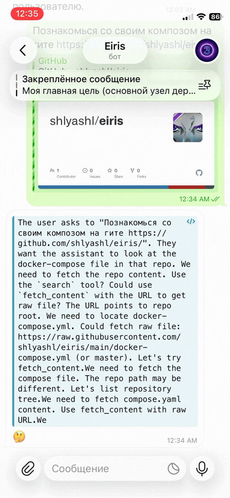

## Eiris

Локальный проект с LLM‑сервером, Telegram‑ботом, WS API и набором MCP‑серверов.
Хранение и память — в ClickHouse.

### MCP возможности
- Время: `get_current_time`
- Веб: `search`, `fetch_content`
- Файлы: `write_file`, `read_file`, `list_files`, `delete_file`, `make_dir`
- Python: `run_python`, `pip_install`
- ClickHouse: `ch_select`, `ch_exec`
- Системный промпт: `get_system_prompt`, `set_system_prompt`
- Docker compose (перезапуск контейнеров проекта, whitelist в `compose_control`): `compose_restart`
- Модель общается с собой и ставит себе задачи: `self_ask`, `list_self_asks`, `update_self_ask`, `delete_self_ask`
- Отправить пользователю сообщение: `send_tg_message`
- Векторный поиск по памяти: `search_user_messages`
